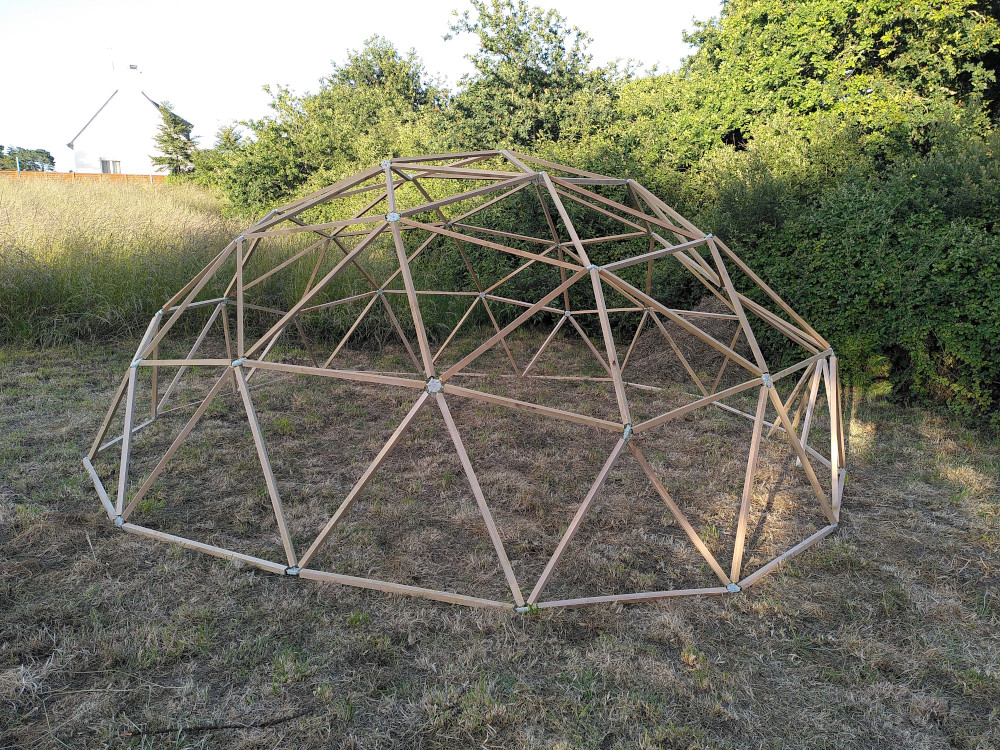
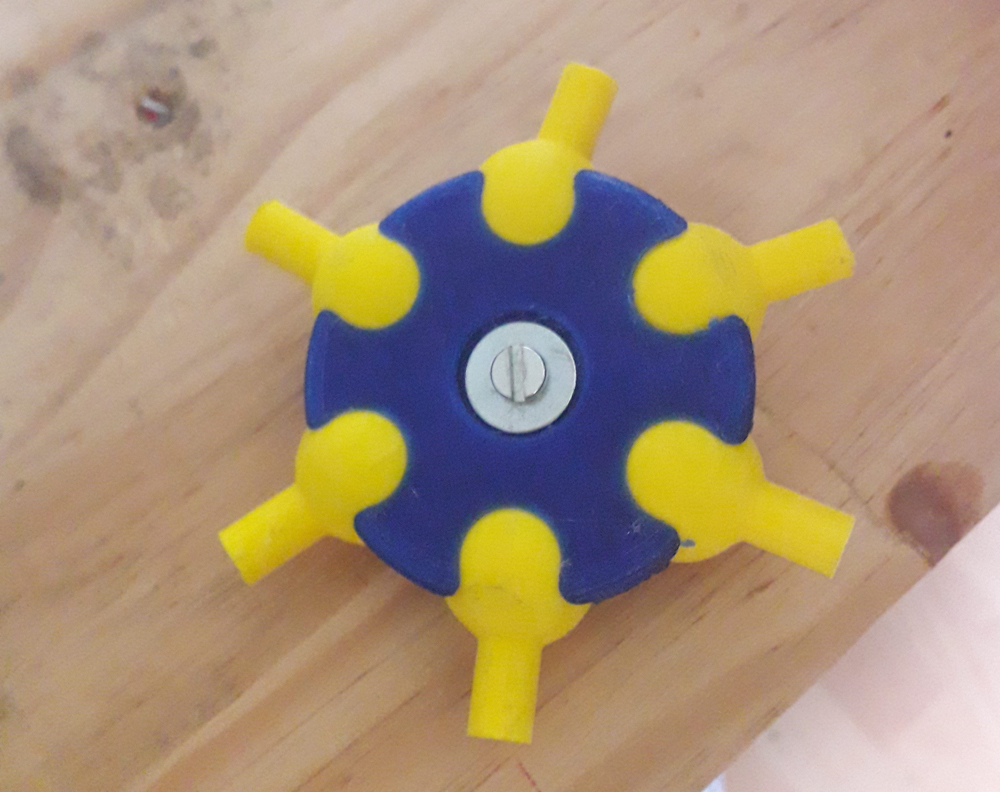

# Piste abandonné n°1

## connecteurs à rotules

Ce projet est le premier essai de construction d'un dôme géodésique de fréquence 3 avec des connecteurs imprimé en 3D. Il était constitué de connecteurs emprisonnant des rotules vissés sur le bout de chaque tasseau. 
Ceci est imspiré du système [domekit par EFFALO (cc-by)](https://www.thingiverse.com/thing:8985) et de la solution commercialisé par la société britanique [Hubs](https://buildwithhubs.co.uk/). 
L'édée de départ était de réaliser un système par rotule qui laisse penser qu'il offre une bonne facilité de montage de manière DIY et imprimmable en 3D. 

**Cette solution n'a pour le moment pas abouti et semble inadapté à un dôme de fréquence 3 et plus. En effet le montage est rendu difficile par le fait que les arrêtes sont trop libres de leurs mouvements. Cette solution semble adapté pour des dômes de fréquences 1 et 2.**

**Date de début du projet :** Juin 2021

**Date de la dernière modification :** 6 juin 2022

**Etat du projet :** A l'arrêt

**Temps :** Une à deux semaines (temps d'impression des pièces) et Un à 2 ou 3 jours de préparation du bois et montage

**Prérequis :** Disposer d'une imprimante 3D et des connaissances liées ainsi que de matériel pour le travail du bois.

## 1. Préparation des connecteurs

 - [Retrouver tous les fichiers en question dans l'archive](https://github.com/gheleguen/geodesic_dome/tree/master/hardware/archives_projets_abandones/connecteurs_a_rotules)
 - Impression des pièces en PETG  en résolution 0,2mm. 
 - Imprimer autant de rotules que de bout de section. 
 - Imprimer les rondelles de 3 couleurs différentes. On affectera une couleur comme code à l'une des trois longueur de tasseau différentes.  
 - **Attention**, pour un connecteur (6 branches par exemple) Il faut 2 pièces bleu 6 emplacements et 6 rotules Jaunes

**A retenir :**
 - Il sera plus facile d'imprimer toutes les pièces en même temps sur un plateau. J'ai rencontré beaucoup de problèmes lié au stringing avec le PETG. Il est donc préférable de prendre le temps d'éradiquer ce problème avant de poursuivre. 
 - Le PLA selon mes essais ne convient pas pour des raisons de dureté. Celui-ci s'érode avec le temps et les rotules perdent en rigidité. Le PLA a tendance à se ramollir dès 60°C ce qui rend difficile le stockage 

## 2. Préparer les pièces de bois

 - En référence au longueur calculé, on se munira de tasseaux de bois ou de rond de bois d'une section de 13mm minimum. **Attention**, la longueur doit être calculé pour perdre un minimum de bois. 
 - Le choix de l'essence est importante. J'ai choisis pour le dôme final du châtaigner fourni par une scierie local. Cette essence est imputrescible et ne demande aucun traitement pour reste en extérieur. Pour un dôme rentrant dans les normes de tenue à la flamme, on choisira une section de 20mm minimum et il sera nécessaire de chanfreiner les arêtes. 
 - Visser à chaque extrémité de chaque tasseau, une rotule avec une rondelle de couleur corespindante à sa taille. 
 

**A retenir :**
 - Il est possible que le bois éclate, pensez à prévoir du bois en plus pour refaire les pièces qui auraient cassés. 

## 3. Assemblage

 - On commence par assembler la croix du sommet du dôme. Elle sera déposé sur le sol avec son pourtour. Le connecteur du sommet sera toujours à 5 branches. 
 - Avec une vis de 4mm, deux rondelles et un écrou on viens serrer 5 rotules d'arrêtes de longueur X à l'aide de deux pièces connecteur 5 trous. 

 - Puis on installe le tour avec des connecteurs 6 branches. [Consulter le plan de montage](http://www.rusticdomes.com/Calculator.html)

**A retenir :**
 - Il est plus simple avec des connecteurs à rotule, de monter le dôme en débutant par le sommet et de monter la structure étage après étage. En commençant par la base, on aura des difficultés à monter chaque étage puisque la structure va pouvoir s'écrouler sur elle même tant que le connecteur du sommet n'est pas positionné. C'est le principe de la [clé de voûte](https://fr.wikipedia.org/wiki/Cl%C3%A9_de_vo%C3%BBte_(architecture)#:~:text=Une%20cl%C3%A9%20de%20vo%C3%BBte%20ou,appara%C3%AEt%20dans%20l'architecture%20gothique)

