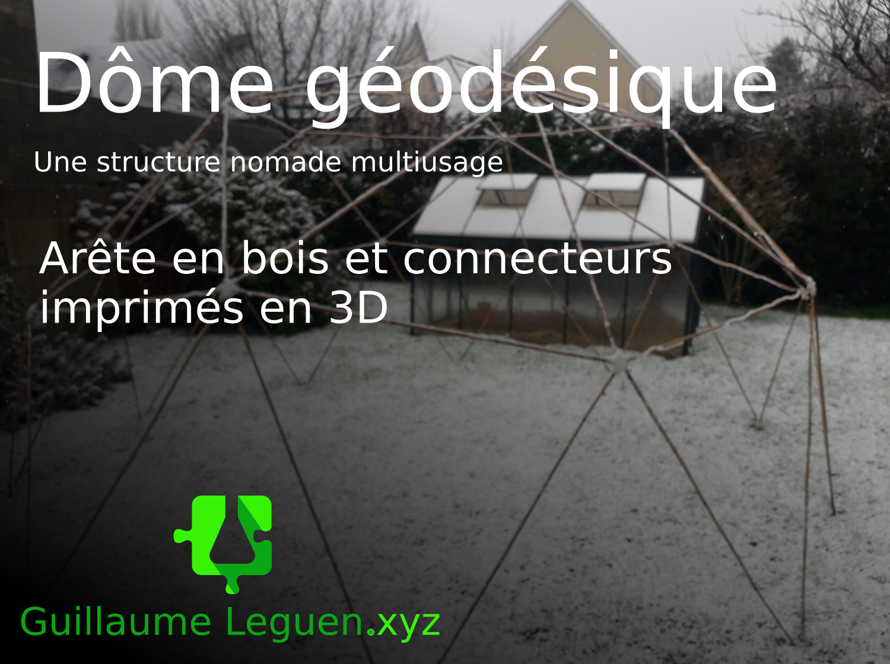

# Un dôme itinérant

**Par Guillaume Leguen** : [voir guillaumeleguen.xyz](http://www.guillaumeleguen.xyz/?PagePrincipale)

Un dôme géodésique est une structure géométrique qui peut servir de simple structure artistique pour habiller un paysage,  comme servir d'espace couvert, si il est recouvert d'une toile. Si cette toile est transparente, le dôme devient une serre de choix. Simple mais un peut long à monter, ce dôme est conçus pour être nomade et pouvoir se monter pour un évènement ou servir simplement à structurer votre emplacement au camping. Il y a plusieurs choses à choisir avant de se lancer. Premièrement, le diamètre du dôme, il définit l'espace au sol qui sera recouvert par le dôme, mais aussi la hauteur du dôme en son centre. Egalement, il faut choisir la fréquence, plus la fréquence d'un dôme géodésique est élevé, plus il y aura de connecteurs et donc de triangles mais plus l'on notr structure s'approchera de la sphère. Pour un petit dôme rapide à monter on choisira la fréquence 2. Pour un dôme plus esthétique, la fréquence 3 conviendra.  

